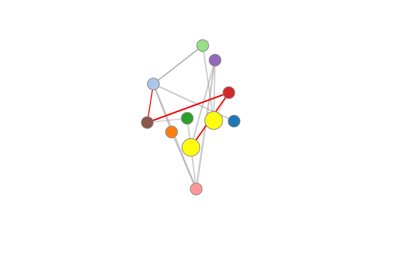

# Graphly

## Graphly is a [D3.js force-directed layout graph](https://github.com/mbostock/d3/wiki/Force-Layout). This is meant as a demonstration of what D3 can be used for. The main functionality is the ability to click and highlight two nodes at a time. It comes with a seed JSON file of hypothetical cities, so you have everything you need to see the demo.

## Instructions for Running on OSX

1. #### Make sure you have Homebrew installed

2. #### Install Node:
  `brew install node`

3. #### Install Node's HTTP Server:
  `npm install http-server -g`

4. #### Start the server in the directory:
`http-server`

5. #### Navigate to localhost:8080

---
The nodes can be clicked on and dragged around the canvas.
Let me know if you have any suggestions for improvements!
